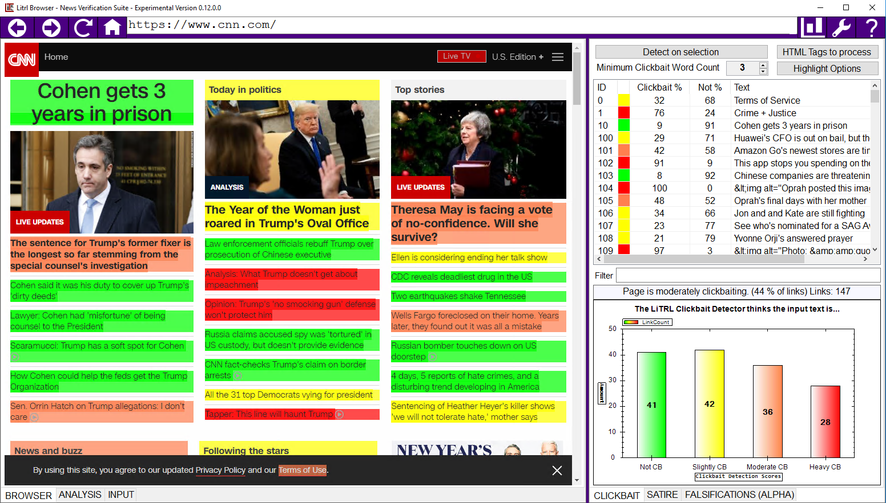

# Description-in-Brief
The LiT.RL News Verification Browser is a research tool for news readers, journalists, editors or information professionals. The tool analyzes the language used in digital news web pages to determine if they are clickbait, satirical news, or falsified news, and visualizes the results by highlighting content in color-coded categories. Although the clickbait, satire, and falsification detectors perform to certain accuracy levels on test data, during real-world internet use accuracy may vary. The browser is not a replacement for digital literacy and is not always correct. All processing is completed on the local machine - results are not sent to or from a remote server. Results may be saved locally to a standard SQLite database for further analysis.

# Summary
Widespread adoption of internet technologies has changed the way that news is created and consumed. The current online news environment is one that incentivizes speed and spectacle in reporting at the cost of fact-checking and verification, encouraging the proliferation of misinformation and disinformation. The LiT.RL News Verification (NV) Browser is a system that offers a first step counter-measure by automatically detecting and highlighting clickbait (to 94% accuracy on a test set of 5670 texts), satirical fake news (to 84% accuracy on a test set of 95 texts), and fabricated news (to 71% accuracy on a test set of 28 texts). The browser was built to study the effectiveness of these deception detectors when applied to online news websites, where the accuracy of these detectors may vary considerably given the variety of styles, formats and content of online news. The system is presented to users as a set of assistive technologies built into a stand-alone browser tuned to identify different varieties of fakes [@Rubin:2015; @Rubin:2017]. Our algorithms look for patterns of subtle lexico-syntactic features in text. Images, audio and video formats are unsupported. The core of the functionality is in the natural language processing (NLP) of textual data and automated classification of results with machine learning using support vector machines.

The LiT.RL NV Browser offers three discrete functionalities:
a.	Detection of clickbait headlines [@Chen:2015:MOC:2823465.2823467; @Brogly];
b.	Detection of satirical article content [@Rubin:2016];
c.	Detection of falsified news articles [@Rubin:2012; @Asubiaro:2018; @Asubiaro].

Each is implemented as a separate overlay option through three tabs at the bottom right of the browser. Currently in its proof of concept stage, the system runs over a batch of website content, such as news feed on a website, and visualizes the results by highlighting content in red, orange or green, by analogy with the traffic stop-light.
 

# Limitations
This browser is meant to augment our human discernment, rather than replace it, by highlighting potentially false information which may require further scrutiny. Digital literacy is key for everyone to effectively evaluate potential misinformation online, and the LiT.RL Browser is NOT a replacement for that [@Chen:2015]. During real-world internet use, the accuracy of the detectors in this tool may vary. News readers’ critical thinking remains key to navigating the increasingly fraught online information landscape. The News Verification Browser is a research tool - not a replacement for a day-to-day web browser. It should not be used where security is critical. 

# Availability
 The source code is openly available on GitHub [@litrl2018] under the GPLv3 license for anyone in the research and development community to use or improve on. The public can download the browser for experimentation on their own computers with “no strings attached”. 

# Acknowledgements
This research has been funded by the Government of Canada Social Sciences and Humanities Research Council (SSHRC) Insight Grant (#435-2015-0065) awarded to Dr. Victoria L. Rubin for the 2015-2018 project entitled “Digital Deception Detection: Identifying Deliberate Misinformation in Online News”.

# References
